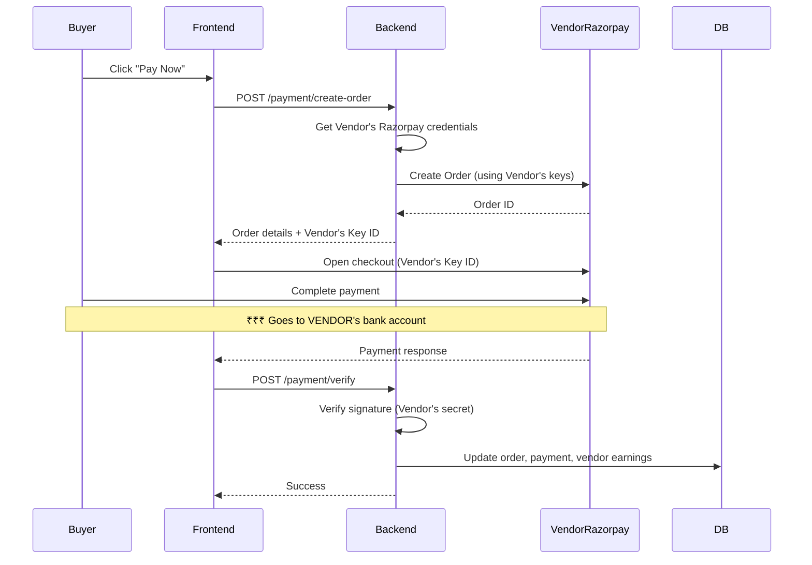
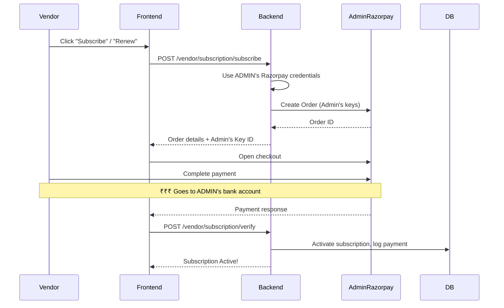

# Paperbox Marketplace - Implementation Plan

A professional, production-ready marketplace connecting Vendors and Buyers for second-hand electronics, accessories, and reusable items.

## Technology Decisions

| Component | Choice | Notes |
|-----------|--------|-------|
| SMS OTP | **Fast2SMS** | Free ₹50 credit, no DLT needed for Quick SMS |
| Image Storage | Cloudinary | 25GB free tier |
| Payment Model | **Vendor-Direct** | Each vendor has their own Razorpay account |

> [!IMPORTANT]
> **Vendor-Direct Payment Model**: Payments go directly to the vendor's Razorpay account. Each vendor must provide their Razorpay API keys during registration.
>
> **Fast2SMS Setup**: Sign up at [fast2sms.com](https://www.fast2sms.com), get free ₹50 credit, copy your API key from the dashboard.

---

## Project Structure

```
a:\Paperbox\
├── backend/                    # Node.js + Express API
│   ├── src/
│   │   ├── config/            # DB, env, constants
│   │   ├── models/            # MongoDB schemas
│   │   ├── routes/            # API routes
│   │   ├── controllers/       # Business logic
│   │   ├── middleware/        # Auth, validation, error handling
│   │   ├── services/          # OTP, payment, email services
│   │   └── utils/             # Helpers
│   ├── uploads/               # Product images
│   ├── .env.example
│   └── package.json
│
├── frontend/                   # React + Vite
│   ├── src/
│   │   ├── components/        # Reusable UI components
│   │   ├── pages/             # Route pages
│   │   ├── layouts/           # Dashboard layouts
│   │   ├── hooks/             # Custom hooks
│   │   ├── context/           # Auth, cart context
│   │   ├── services/          # API calls
│   │   ├── styles/            # Global styles
│   │   └── utils/             # Helpers
│   ├── public/
│   └── package.json
│
└── README.md
```

---

## Proposed Changes

### Backend Core Setup

#### [NEW] [package.json](file:///a:/Paperbox/backend/package.json)
- Express.js server with essential middleware
- Dependencies: express, mongoose, jsonwebtoken, bcryptjs, cors, dotenv, multer, razorpay

#### [NEW] [server.js](file:///a:/Paperbox/backend/src/server.js)
- Entry point with MongoDB connection
- Middleware setup (CORS, body-parser, security headers)
- Route mounting

#### [NEW] [config/](file:///a:/Paperbox/backend/src/config/)
- `db.js`: MongoDB connection with Mongoose
- `constants.js`: Role enums, order statuses, categories

---

### MongoDB Models

#### [NEW] [models/User.js](file:///a:/Paperbox/backend/src/models/User.js)
```javascript
{
  name: String,
  email: String (unique, optional for buyers),
  phone: String (unique, required),
  role: enum ['admin', 'vendor', 'buyer'],
  status: enum ['pending', 'approved', 'blocked'],
  address: { street, city, state, pincode },
  // Admin only:
  password: String (hashed),
  secretKey: String,
  // Vendor only:
  businessName: String,
  gstNumber: String,
  razorpayKeyId: String (encrypted),     // Vendor's Razorpay Key
  razorpayKeySecret: String (encrypted), // Vendor's Razorpay Secret
  totalEarnings: Number
}
```

#### [NEW] [models/Product.js](file:///a:/Paperbox/backend/src/models/Product.js)
```javascript
{
  vendorId: ObjectId (ref: User),
  name: String,
  description: String,
  category: enum ['electronics', 'laptops', 'keyboards', 'accessories', 'phones', 'other'],
  condition: enum ['new', 'like-new', 'used'],
  price: Number,
  quantity: Number,
  images: [String],
  isActive: Boolean,
  createdAt, updatedAt
}
```

#### [NEW] [models/Order.js](file:///a:/Paperbox/backend/src/models/Order.js)
```javascript
{
  buyerId: ObjectId,
  vendorId: ObjectId,
  items: [{ productId, name, price, quantity }],
  totalAmount: Number,
  status: enum ['placed', 'confirmed', 'packed', 'shipped', 'out-for-delivery', 'delivered', 'cancelled'],
  paymentId: ObjectId,
  shippingAddress: Object,
  deliveryOtp: String,
  deliveryOtpVerified: Boolean,
  timeline: [{ status, timestamp }]
}
```

#### [NEW] [models/Payment.js](file:///a:/Paperbox/backend/src/models/Payment.js)
```javascript
{
  orderId: ObjectId,
  vendorId: ObjectId,              // Whose Razorpay account received payment
  razorpayOrderId: String,
  razorpayPaymentId: String,
  amount: Number,
  status: enum ['pending', 'success', 'failed', 'refunded'],
  method: String,
  refundId: String,
  paidToVendor: Boolean            // Confirms vendor received payment
}
```

#### [NEW] [models/OTP.js](file:///a:/Paperbox/backend/src/models/OTP.js)
```javascript
{
  phone: String,
  otp: String,
  type: enum ['login', 'signup', 'delivery'],
  expiresAt: Date,
  verified: Boolean
}
```

#### [NEW] [models/Feedback.js](file:///a:/Paperbox/backend/src/models/Feedback.js)
```javascript
{
  orderId: ObjectId,
  productId: ObjectId,
  vendorId: ObjectId,
  buyerId: ObjectId,
  rating: Number (1-5),
  review: String,
  isModerated: Boolean
}
```

#### [NEW] [models/RefundRequest.js](file:///a:/Paperbox/backend/src/models/RefundRequest.js)
```javascript
{
  orderId: ObjectId,
  buyerId: ObjectId,
  reason: String,
  images: [String],
  status: enum ['pending', 'approved', 'rejected'],
  adminNotes: String,
  refundAmount: Number
}
```

#### [NEW] [models/SubscriptionPlan.js](file:///a:/Paperbox/backend/src/models/SubscriptionPlan.js)
```javascript
{
  name: String,                    // "Basic", "Pro", "Premium"
  price: Number,                   // Monthly price in INR
  duration: Number,                // Duration in days (30 = monthly)
  features: [String],              // List of features
  maxProducts: Number,             // Max products vendor can list
  isActive: Boolean
}
```

#### [NEW] [models/Subscription.js](file:///a:/Paperbox/backend/src/models/Subscription.js)
```javascript
{
  vendorId: ObjectId,
  planId: ObjectId (ref: SubscriptionPlan),
  status: enum ['active', 'expired', 'cancelled'],
  startDate: Date,
  endDate: Date,
  autoRenew: Boolean,
  // Payment tracking (paid to Admin's Razorpay)
  razorpaySubscriptionId: String,
  payments: [{
    razorpayPaymentId: String,
    amount: Number,
    paidAt: Date,
    status: String
  }]
}
```

---

### Authentication System

#### [NEW] [services/otpService.js](file:///a:/Paperbox/backend/src/services/otpService.js)
- Generate 6-digit OTP
- Store in database with expiry (5 minutes)
- SMS integration placeholder (mock for development)
- Verify OTP logic

#### [NEW] [middleware/auth.js](file:///a:/Paperbox/backend/src/middleware/auth.js)
- JWT verification middleware
- Role-based access control
- `isAdmin`, `isVendor`, `isBuyer` guards

#### [NEW] [routes/auth.js](file:///a:/Paperbox/backend/src/routes/auth.js)
| Endpoint | Method | Description |
|----------|--------|-------------|
| `/auth/send-otp` | POST | Send OTP to phone |
| `/auth/verify-otp` | POST | Verify OTP, return JWT |
| `/auth/vendor/signup` | POST | Vendor registration |
| `/auth/admin/login` | POST | Admin login with password + OTP/secret |
| `/auth/me` | GET | Get current user profile |

---

### API Routes

#### [NEW] [routes/admin.js](file:///a:/Paperbox/backend/src/routes/admin.js)
| Endpoint | Method | Description |
|----------|--------|-------------|
| `/admin/users` | GET | List all users with filters |
| `/admin/users/:id/status` | PATCH | Block/unblock user |
| `/admin/vendors/pending` | GET | Pending vendor approvals |
| `/admin/vendors/:id/approve` | PATCH | Approve vendor |
| `/admin/products` | GET | All products |
| `/admin/products/:id` | DELETE | Remove listing |
| `/admin/orders` | GET | All orders |
| `/admin/analytics` | GET | Platform stats |
| `/admin/refunds` | GET | Refund requests |
| `/admin/refunds/:id` | PATCH | Approve/reject refund |
| `/admin/subscriptions/plans` | GET/POST | List/create subscription plans |
| `/admin/subscriptions/plans/:id` | PUT/DELETE | Update/delete plans |
| `/admin/subscriptions` | GET | All vendor subscriptions |
| `/admin/subscriptions/revenue` | GET | Subscription revenue analytics |

#### [NEW] [routes/vendor.js](file:///a:/Paperbox/backend/src/routes/vendor.js)
| Endpoint | Method | Description |
|----------|--------|-------------|
| `/vendor/products` | GET/POST | List/create products |
| `/vendor/products/:id` | PUT/DELETE | Update/delete product |
| `/vendor/orders` | GET | Orders for vendor |
| `/vendor/orders/:id/status` | PATCH | Update order status |
| `/vendor/orders/:id/delivery-otp` | POST | Generate delivery OTP |
| `/vendor/earnings` | GET | Earnings summary |
| `/vendor/subscription` | GET | Current subscription status |
| `/vendor/subscription/plans` | GET | Available subscription plans |
| `/vendor/subscription/subscribe` | POST | Subscribe to a plan |
| `/vendor/subscription/renew` | POST | Renew subscription |
| `/vendor/razorpay-keys` | PUT | Update Razorpay API keys |

#### [NEW] [routes/buyer.js](file:///a:/Paperbox/backend/src/routes/buyer.js)
| Endpoint | Method | Description |
|----------|--------|-------------|
| `/products` | GET | Browse products |
| `/products/:id` | GET | Product details |
| `/cart` | GET/POST/DELETE | Cart operations |
| `/checkout` | POST | Create order |
| `/orders` | GET | Buyer's orders |
| `/orders/:id` | GET | Order details |
| `/orders/:id/verify-delivery` | POST | Verify delivery OTP |
| `/orders/:id/refund` | POST | Request refund |
| `/orders/:id/feedback` | POST | Submit feedback |

#### [NEW] [routes/payment.js](file:///a:/Paperbox/backend/src/routes/payment.js)
| Endpoint | Method | Description |
|----------|--------|-------------|
| `/payment/create-order` | POST | Create Razorpay order |
| `/payment/verify` | POST | Verify payment signature |
| `/payment/webhook` | POST | Razorpay webhook |

---

### Frontend Structure

#### [NEW] [package.json](file:///a:/Paperbox/frontend/package.json)
- React 18 with Vite
- Dependencies: react-router-dom, axios, tailwindcss, react-hot-toast, lucide-react, razorpay

#### [NEW] Design System
- **Colors**: Deep purple primary (#6366f1), warm accents
- **Dark mode** support
- **Glassmorphism** effects for cards
- **Smooth animations** with CSS transitions

#### [NEW] Core Components
- `Navbar.jsx`: Responsive navigation with cart icon
- `ProductCard.jsx`: Animated product cards with hover effects
- `CartDrawer.jsx`: Slide-out cart panel
- `OTPInput.jsx`: 6-digit OTP input component
- `StatusBadge.jsx`: Order status indicators
- `RatingStars.jsx`: Star rating component
- `LoadingSkeleton.jsx`: Content loading placeholders

---

### Frontend Pages

#### Public Pages
| Page | Path | Description |
|------|------|-------------|
| Landing | `/` | Hero, categories, featured products, brand story |
| Products | `/products` | Browse with search/filter |
| Product Detail | `/products/:id` | Full product info, add to cart |
| Login | `/login` | OTP-based login |

#### Buyer Dashboard
| Page | Path | Description |
|------|------|-------------|
| My Orders | `/buyer/orders` | Order list with tracking |
| Order Detail | `/buyer/orders/:id` | Full order timeline |
| Cart | `/cart` | Cart management |
| Checkout | `/checkout` | Address, payment |

#### Vendor Dashboard
| Page | Path | Description |
|------|------|-------------|
| Dashboard | `/vendor` | Overview stats |
| Products | `/vendor/products` | CRUD products |
| Orders | `/vendor/orders` | Manage orders |
| Earnings | `/vendor/earnings` | Payout info |

#### Admin Panel
| Page | Path | Description |
|------|------|-------------|
| Dashboard | `/admin` | Analytics overview |
| Users | `/admin/users` | Manage all users |
| Products | `/admin/products` | Moderate listings |
| Orders | `/admin/orders` | All orders |
| Refunds | `/admin/refunds` | Handle refunds |
| Settings | `/admin/settings` | Categories, banners |

---

### Payment Flow (Vendor-Direct Razorpay)

> [!NOTE]
> **Buyer pays → Money goes directly to Vendor's Razorpay account**



### Multi-Vendor Cart Handling
If buyer's cart has items from **multiple vendors**:
1. Cart is split into **separate orders** (one per vendor)
2. Each order has its own payment
3. Buyer pays each vendor separately

---

### Subscription Payment Flow (Vendor → Admin)

> [!NOTE]
> **Vendor pays subscription → Money goes to ADMIN's Razorpay account**



### Two Razorpay Flows Summary

| Payment Type | Whose Razorpay? | Money Goes To |
|--------------|-----------------|---------------|
| **Product Purchase** | Vendor's keys | Vendor's bank |
| **Subscription Fee** | Admin's keys | Admin's bank |

---

## Verification Plan

### Automated Tests

Since this is a new project, I'll create the test infrastructure:

```bash
# Backend tests (Jest)
cd backend
npm test

# Test categories:
# - Unit tests for services (OTP, payment)
# - API integration tests for each route
# - Middleware tests (auth, validation)
```

### Manual Testing Checklist

#### 1. Authentication Flow
```
1. Open http://localhost:5173
2. Click "Login" → Enter phone number → Click "Send OTP"
3. Check console for mock OTP (or SMS if configured)
4. Enter OTP → Verify redirect to home/dashboard
5. Test vendor signup with pending approval
6. Test admin login at /admin/login with credentials + secret key
```

#### 2. Buyer Journey
```
1. Browse products on home page
2. Use search and category filters
3. Click product → View details
4. Add to cart → Verify cart updates
5. Proceed to checkout
6. Enter address → Complete Razorpay payment (test mode)
7. Verify order appears in "My Orders"
8. Track order status updates
```

#### 3. Vendor Journey
```
1. Login as approved vendor
2. Access vendor dashboard
3. Add new product with images
4. View incoming orders
5. Update order status through lifecycle
6. Generate delivery OTP
```

#### 4. Admin Journey
```
1. Login at /admin/login
2. View analytics dashboard
3. Approve pending vendor
4. Block/unblock user
5. Remove inappropriate product
6. Handle refund request
```

#### 5. Razorpay Integration
```
1. Use test card: 4111 1111 1111 1111
2. Complete test payment
3. Verify payment status updates
4. Test failed payment scenario
5. Process refund through admin
```

---

## Implementation Order

1. **Day 1-2**: Backend setup, MongoDB models, basic auth
2. **Day 3-4**: Complete backend APIs (admin, vendor, buyer)
3. **Day 5-6**: Frontend setup, landing page, product browsing
4. **Day 7-8**: Authentication UI, dashboards
5. **Day 9**: Razorpay integration
6. **Day 10**: Polish, testing, documentation

---

## Environment Variables Required

```env
# Backend (.env)
PORT=5000
MONGODB_URI=mongodb://localhost:27017/paperbox
JWT_SECRET=your-super-secret-key
JWT_EXPIRES_IN=7d

# Cloudinary (Image Storage)
CLOUDINARY_CLOUD_NAME=your-cloud-name
CLOUDINARY_API_KEY=your-api-key
CLOUDINARY_API_SECRET=your-api-secret

# Encryption key for storing vendor Razorpay secrets
ENCRYPTION_KEY=32-character-secret-key-here

# Admin's Razorpay (for subscription payments)
ADMIN_RAZORPAY_KEY_ID=rzp_test_xxxxx
ADMIN_RAZORPAY_KEY_SECRET=xxxxx

# Fast2SMS - Free OTP Provider (₹50 free credit)
# Get API key from: https://www.fast2sms.com/dashboard/dev-api
FAST2SMS_API_KEY=your-fast2sms-api-key

# Admin seed
ADMIN_PHONE=9999999999
ADMIN_EMAIL=admin@paperbox.com
ADMIN_PASSWORD=Admin@123
ADMIN_SECRET_KEY=PAPERBOX-ADMIN-2024
```

> [!IMPORTANT]
> **Two Razorpay Accounts Needed:**
> - **Admin's Razorpay**: For receiving vendor subscription payments (you need to create this)
> - **Vendor's Razorpay**: Each vendor provides their own keys to receive product payments

---

> [!NOTE]
> This plan creates a **fully functional MVP** with all core features. Advanced features like real-time notifications, email integration, and advanced analytics can be added incrementally.
